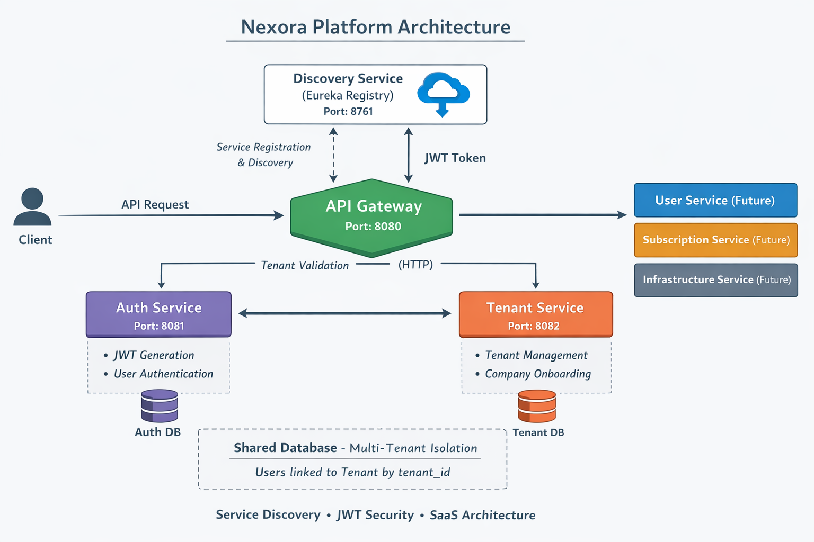

# Nexora Platform

## Overview

Nexora Platform is a production-style SaaS backend architecture built using a microservices approach.
The project simulates a real-world enterprise backend platform where multiple organizations (tenants) can manage users, subscriptions, and billing within a secure and isolated environment.

The system demonstrates modern backend engineering practices including:

* Microservices architecture
* Multi-tenant isolation
* Secure authentication using JWT
* API Gateway routing
* Service discovery
* Containerized deployment
* CI/CD automation
* Observability and monitoring

The goal of this project is to showcase how a scalable SaaS backend system can be designed and implemented using modern Java and cloud-native technologies.

---

# Architecture

The platform follows a distributed microservices architecture.

Each core domain is implemented as an independent service with its own database and responsibility.

Main architectural components:

* API Gateway
* Service Discovery
* Authentication Service
* Tenant Management Service
* User Management Service
* Subscription Management Service
* Billing Service

All services communicate through internal service discovery and are designed to be independently deployable.

---

## System Architecture

The following diagram illustrates the high-level architecture of the Nexora Platform.

---

# Microservices

## Discovery Service

Handles service registration and discovery for all platform services.

Responsibilities:

* Service registry
* Service lookup
* Microservice coordination

---

## API Gateway

Single entry point for all client requests.

Responsibilities:

* Request routing
* Authentication propagation
* Header forwarding
* Correlation ID generation
* Security enforcement

---

## Auth Service

Responsible for authentication and identity management.

Responsibilities:

* User registration
* Login
* JWT token generation
* Authentication validation

---

## Tenant Service

Handles organization onboarding and tenant lifecycle.

Responsibilities:

* Tenant creation
* Tenant metadata management
* Multi-tenant identity

Each tenant represents a company using the platform.

---

## User Service

Manages business users inside each tenant.

Responsibilities:

* User profiles
* Role management
* Tenant-scoped user isolation

All user data is isolated using tenant identifiers.

---

## Subscription Service

Manages SaaS plans and tenant subscriptions.

Responsibilities:

* Plan management
* Assigning subscription plans to tenants
* Subscription lifecycle

Example plans:

* Free
* Pro
* Enterprise

---

## Billing Service

Handles financial operations related to subscriptions.

Responsibilities:

* Invoice generation
* Payment tracking
* Billing history

---

# Multi-Tenant Architecture

The platform uses a **shared database with tenant isolation strategy**.

Key principles:

* Each entity contains a `tenantId`
* All queries are tenant-scoped
* Requests must include a tenant identifier
* Data leakage between tenants is prevented

Tenant context is propagated through request headers and maintained during request processing.

---

# Security

Authentication is implemented using JWT tokens.

Security flow:

1. User authenticates via Auth Service
2. JWT token is issued
3. API Gateway validates the token
4. User and tenant identifiers are propagated to downstream services

---

# Infrastructure

The platform is fully containerized using Docker.

Each microservice runs in its own container.

Infrastructure includes:

* Docker containers for each service
* Containerized PostgreSQL databases
* Internal service networking

This setup allows the system to be deployed consistently across environments.

---

# Observability

Monitoring and health checks are implemented using Spring Boot Actuator.

Available endpoints include:

* Service health
* Application metrics
* System status

Distributed request tracing is supported through correlation identifiers.

---

# CI/CD

Continuous Integration is implemented using GitHub Actions.

Pipeline steps include:

1. Source checkout
2. Java build
3. Automated testing
4. Docker image build
5. Artifact publishing

This ensures consistent builds and automated validation of code changes.

---

# Running the Platform

To run the platform locally:

1. Clone all service repositories
2. Start infrastructure using Docker
3. Start discovery service
4. Start API gateway
5. Start remaining microservices

All services will automatically register with the discovery server.

---

# Project Goals

This project demonstrates:

* Enterprise backend architecture
* SaaS platform design
* Production-ready service structure
* DevOps and deployment practices
* Multi-service coordination

The platform is designed as a portfolio project to simulate real-world backend systems used in modern SaaS companies.

---

# Author

Ali Al-Jalo
Backend Developer

This project was built as part of a backend engineering portfolio focused on distributed systems and SaaS architecture.
